# Credit_Risk_Analysis

## Overview of the analysis:

The purpose of this analysis was to build and evaluate various machine learning models to evaluate individual customer credit risk. The dataset used to train the models was from LendingClub, "a peer-to-peer lending services company.

## Results: 

The original dataset contained 115,675 loan applications in Q1 of 2019. We used the "loan status" to determine whether the application was considered "low" or "high" risk. Applications that had "current" as the "loan status" were classified as "low risk" and the remaining as "high risk". This reduced the dataset to 68,817 total applications with 99% classified as "low risk". 

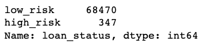

Using the 75/25% method to split the data for training vs. testing, 51,366 "low risk" and 246 "high risk" applications were categorized into the training set.   

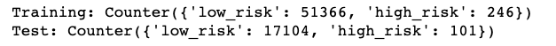

### Use Resampling Models to Predict Credit Risk

**RandomOverSampler** Model randomly selects from the minority class and adds it to the training set until both classifications are equal. The results classified 51,366 records each as High Risk and Low Risk.

  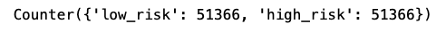

  * Balanced accuracy score: 64%.

  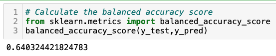

  * The "High Risk" precision rate was only 1% with the recall at 66% giving this model an F1 score of 2%.
  * "Low Risk" had a precision rate of 100% and recall at 62%.  
  
  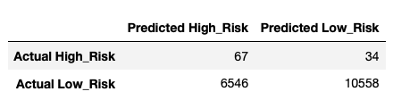
  
  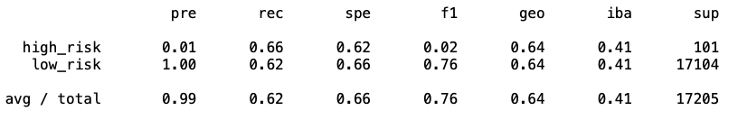
  
**SMOTE (Synthetic Minority Oversampling Technique) Model**, like RandomOverSampler increases the size of the minority class by creating new values based on the value of the closest neighbors to the minority class instead of random selection. 

  * The balanced accuracy score improved slightly to 65.1%.

  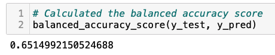

  * Like `RandomOverSampler`, the "High Risk" precision rate again was only 1% with the recall degraded to 61% giving this model an F1 score of 2%.
  * "Low Risk" had a precision rate of 100% and an improved recall at 69%.  

  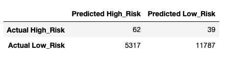
  
  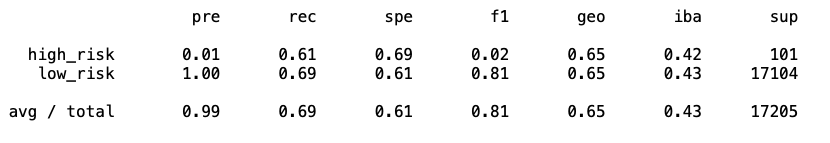
  
**ClusterCentroids Model**, an algorithm that identifies clusters of the majority class to generate synthetic data points that are representative of the clusters. The model classified 246 records each as High Risk and Low Risk.

  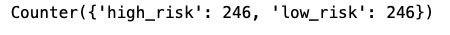

  * Balanced accuracy score was lower than the oversampling models at 54.5%.

  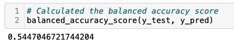

  * The "High Risk" precision rate again was only at 1% with the recall at 69% giving this model an F1 score of 1%.
  * "Low Risk" had a precision rate of 100% and with a lower recall at 40% compared to the oversampling models.  

  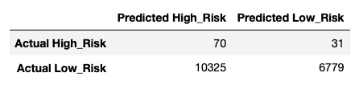
  
  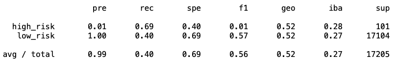
  
### Use the SMOTEENN algorithm to Predict Credit Risk

**SMOTEENN (Synthetic Minority Oversampling Technique + Edited NearestNeighbors) Model** combines aspects of both oversampling and undersampling. The model classified 68,460 records as High Risk and 62,011 as Low Risk.

  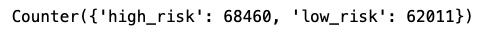

  * The balanced accuracy score improved to 64.5% when using a combined sampling model.

  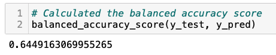

  * The "High Risk" precision rate did not improve was only 1%, however the recall increased to 72% giving this model an F1 score of 2%.
  * "Low Risk" still showed a precision rate of 100% with the recall at 57%.  
  
  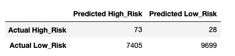

  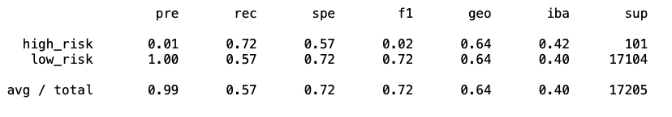
  
### Use Ensemble Classifiers to Predict Credit Risk

The models classified here are 51,366 as High Risk and 246 as Low Risk.

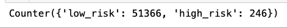

**BalancedRandomForestClassifier Model**, two trees of the same size and equal size to the minority class are constructed to represent one for the majority class and one for the minority class. 

  * The balanced accuracy score increased to 78.9% for this model.

  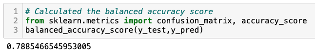

  * The "High Risk precision rate increased to 3% with the recall at 70% giving this model an F1 score of 6%.
  * "Low Risk" still had a precision rate of 100% with the recall at 87%.  
  * The top feature by importance was "total_rec_prncp" at 7.9% of the total.

  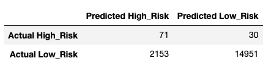
  
  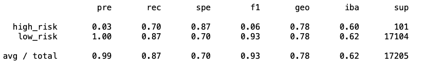

  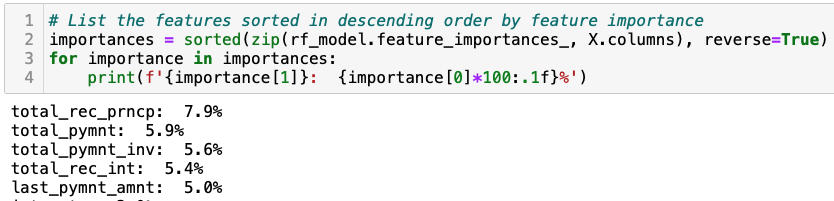 

**EasyEnsembleClassifier Model**, a set of classifiers where individual decisions are combined to classify new examples.

  * The balanced accuracy score increased to 93.2% with this model.

  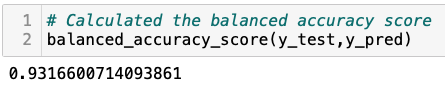

  * The "High Risk precision rate increased to 9% with the recall at 92% giving this model an F1 score of 16%.
  * "Low Risk" still had a precision rate of 100% with the recall now at 94%.  

  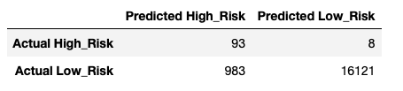
  
  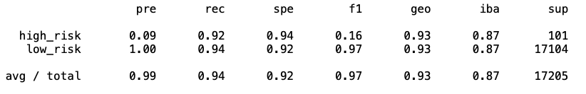
  
## Summary: 

To sum up it is important to say that the EasyEnsembleClassifer model yielded the best results with an accuracy rate of 93.2% and a 9% precision rate when predicting "High Risk candidates. The sensitivity rate (aka recall) was also the highest at 92% compared to the other models. The result for predicting "Low Risk" was also the highest with the sensitivity rate at 94% and an F1 score of 97%. Therefore, if a model needed to be recommended to perform this type of analysis, then this one would be the best choice.